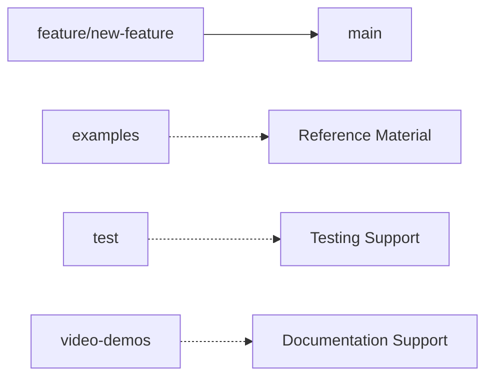

# OLAF Branching Strategy

This document outlines the branching strategy for the OLAF repository to ensure clear development workflows and maintain code quality.

## Branch Overview

### `main` - Production Branch
- **Purpose**: Stable, production-ready OLAF framework for all users
- **Status**: Always functional and tested
- **Usage**: Default branch for downloads and installations
- **Protection**: Protected branch - requires pull requests for all changes

### `feature/*` - Feature Development Branches
- **Purpose**: Development of new features, improvements, and documentation updates
- **Naming**: Prefix with `feature/` followed by descriptive name (e.g., `feature/new-prompts`, `feature/documentation-update`)
- **Status**: Work in progress - may contain experimental functionality
- **Lifecycle**: 
  - Created from latest `main` branch
  - Developed until feature is complete and tested
  - Merged to `main` via pull request
  - Deleted after successful merge
- **Usage**: All new development work should use feature branches

### Utility Branches
- **`examples`**: Example implementations and use cases
- **`test`**: Testing utilities and test cases
- **`video-demos`**: Video demonstration materials
- **Purpose**: Specialized content that supports the main framework

## Development Workflow

### For Contributors

1. **New Features**: Create `feature/*` branch from latest `main`
2. **Development**: Work on feature until stable and tested
3. **Pull Request**: Submit pull request to `main` branch
4. **Review**: Code review and testing by maintainers
5. **Merge**: Feature merged to `main` after approval
6. **Cleanup**: Feature branch deleted after successful merge

### For Users

- **Stable Use**: Always use `main` branch for production
- **Examples**: Check `examples` branch for implementation examples
- **Testing**: Use `test` branch for testing utilities
- **Learning**: Use `video-demos` branch for demonstration materials

## Branch Protection Rules

- **main**: Protected - requires pull request and review for all changes
- **feature/***: No protection - development freedom for feature work
- **examples, test, video-demos**: Semi-protected - specialized content branches

**Note**: The main branch has protection rules that require all changes to be made through pull requests. Direct pushes may be bypassed in exceptional circumstances but should follow the standard pull request workflow.

## Installation Recommendations

- **Production**: Download from `main` branch (default and recommended)
- **Development**: Clone repository and create `feature/*` branches for new work
- **Examples**: Reference `examples` branch for implementation patterns
- **Testing**: Use `test` branch for testing utilities and frameworks

## Best Practices

- Always create feature branches from the latest `main`
- Use descriptive branch names: `feature/add-new-prompt-type`
- Keep feature branches focused on single features or improvements
- Delete feature branches after successful merge to keep repository clean
- Regular sync with `main` to avoid conflicts

---

**Last Updated**: 20251018-1200 CEDT
