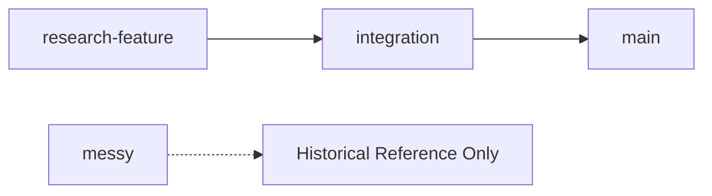

# OLAF Branching Strategy

This document outlines the branching strategy for the OLAF repository to ensure clear development workflows and maintain code quality.

## Branch Overview

### `main` - Production Branch
- **Purpose**: Stable, production-ready OLAF framework for all users
- **Status**: Always functional and tested
- **Usage**: Default branch for downloads and installations
- **Protection**: Direct commits not allowed - only via pull requests from `integration`

### `integration` - Staging Branch  
- **Purpose**: Reintegration of proven research features that are candidates for `main`
- **Status**: Functional but may contain new features under final validation
- **Usage**: Testing ground for features before they reach production
- **Workflow**: Receives pull requests from `research-*` branches after validation

### `research-*` - Feature Branches
- **Purpose**: Temporary experimental and development branches
- **Naming**: Prefix with `research-` (e.g., `research-new-prompts`, `research-ui-improvements`)
- **Status**: **Mostly broken functionality** - experimental work in progress
- **Lifecycle**: 
  - Created for specific research or feature development
  - Merged to `integration` when proven and functional
  - Deleted after successful integration
- **Warning**: ⚠️ These branches may not work and are not suitable for production use

### `messy` - Legacy Branch
- **Purpose**: Old OLAF version with many trial-and-error attempts
- **Status**: **DO NOT TOUCH** - Historical reference only
- **Usage**: Preserved for historical context but not maintained
- **Warning**: 🚫 Do not base new work on this branch

## Development Workflow

### For Contributors

1. **New Features**: Create `research-*` branch from `integration`
2. **Development**: Work on feature until stable and tested
3. **Integration**: Submit pull request to `integration` branch
4. **Production**: After validation, `integration` is merged to `main`

### For Users

- **Stable Use**: Always use `main` branch latest release
- **Early Access**: Use `integration` for preview of upcoming features
- **Avoid**: Never use `research-*` or `messy` branches for actual work

## Branch Protection Rules

- **main**: Protected - requires pull request and review
- **integration**: Semi-protected - requires pull request
- **research-***: No protection - development freedom
- **messy**: Protected - read-only historical preservation

## Installation Recommendations

- **Production**: Download from `main` branch (default)
- **Testing**: Download from `integration` branch for preview features
- **Development**: Clone repository and work on `research-*` branches

---

**Last Updated**: 20250911-1428 CEDT
