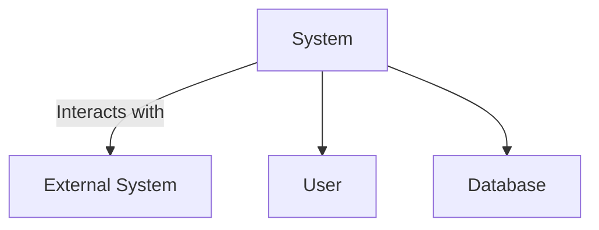
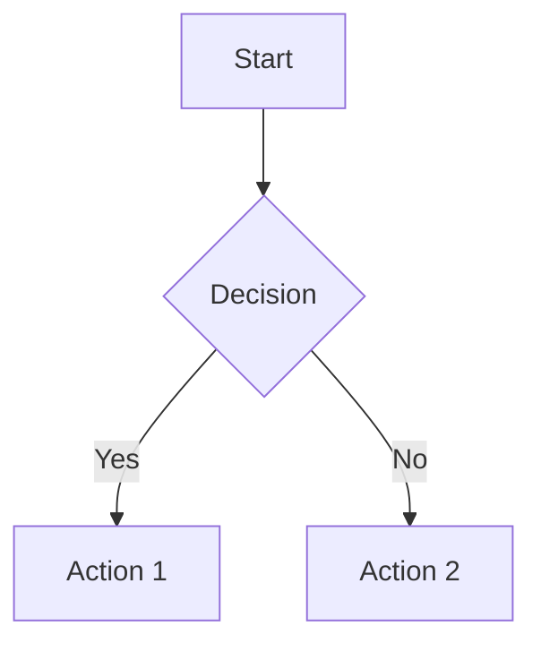

## Input Parameters
**IMPORTANT**: When you don't have entries provided, ask the USER to provide them.
- **spec_path**: string - Path to the existing functional specification
- **output_path**: string - (Optional) Path to save the enhanced specification (default: appends "_enhanced" to input filename)
- **focus_areas**: array[diagrams,data_models,terminology] - (Optional) Specific aspects to enhance (default: all)
- **mermaid_theme**: string - (Optional) Theme for Mermaid diagrams (default: "default")

## Process

1. **Specification Analysis**:
   - Parse the existing document
   - Identify sections needing enhancement
   - Assess current documentation quality
   - Determine optimal placement for new elements

2. **Visual Enhancement**:
   - Create Mermaid diagrams for complex processes
   - Generate architecture and flow diagrams
   - Add state and sequence diagrams
   - Ensure visual consistency

3. **Data Definition**:
   - Extract and document data objects
   - Create detailed attribute tables
   - Define constraints and validation rules
   - Add example values

4. **Terminology Standardization**:
   - Compile domain-specific terms
   - Define acronyms and jargon
   - Create comprehensive glossary
   - Ensure consistent usage

## Output/Result Format
- Enhanced markdown document in [id:findings_dir] with:
  - Embedded Mermaid diagrams
  - Structured data object tables
  - Comprehensive terminology section
  - Improved formatting and organization

## Output to USER
1. **Enhancement Report**:
   - Summary of changes made
   - Number of diagrams added
   - Data objects documented
   - Terms defined

2. **Preview of Enhancements**:
   - Sample diagrams
   - Example data tables
   - Glossary preview

3. **Usage Instructions**:
   - How to view diagrams
   - Navigating data definitions
   - Updating the enhanced spec

## Domain-Specific Rules
- Rule 1: Maintain original document structure
- Rule 2: Use consistent diagram styling
- Rule 3: Follow data modeling best practices
- Rule 4: Define all domain-specific terms
- Rule 5: Preserve original content meaning

## Required Actions
1. Analyze specification content
2. Generate visual elements
3. Document data structures
4. Compile terminology
5. Validate enhancements

## Diagram Types

### Context Diagram

### User Flow

### Data Object Table
| Attribute | Type | Description | Constraints | Example |
|-----------|------|-------------|-------------|---------|
| user_id | UUID | Unique identifier | Required, Unique | 123e4567-... |
| username | String | User login name | 3-50 chars, alphanumeric | johndoe |

## Terminology Example
- **API**: Application Programming Interface
- **JWT**: JSON Web Token, used for authentication
- **UI**: User Interface

⚠️ **Critical Notes**
- Never modify original content meaning
- Ensure diagrams remain readable
- Validate all data definitions
- Keep terminology consistent
- Document assumptions and limitations
