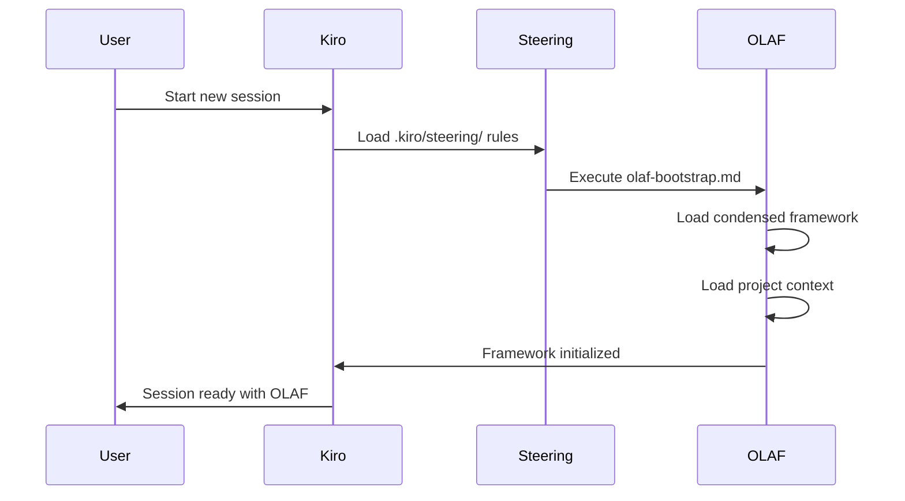
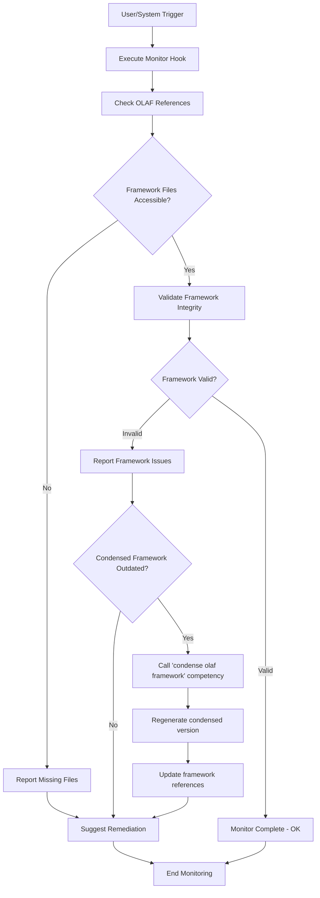
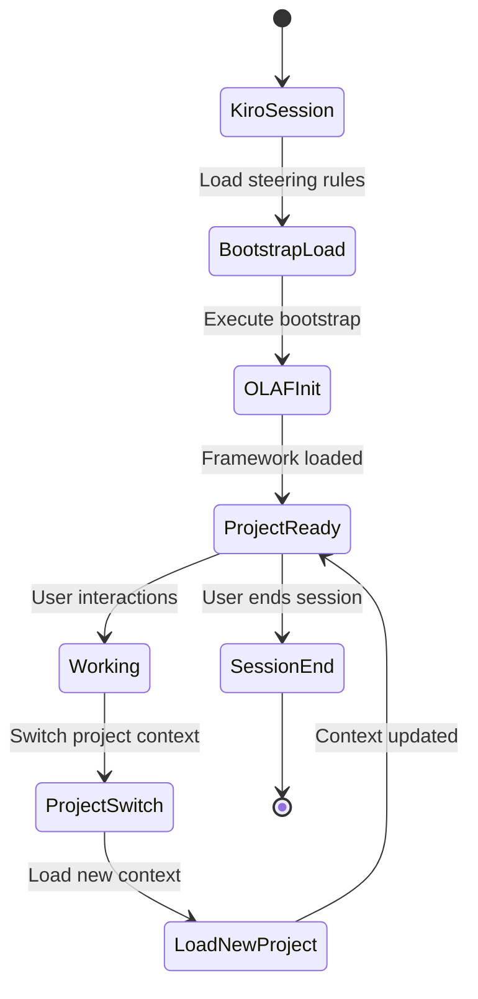

# OLAF AWS Kiro Integration Feature

**Feature Name**: adding-olaf-into-aws-kiro  
**Description**: Supporting OLAF in AWS Kiro using the Kiro structure  
**Created**: 20251015-1647 CEDT  
**Source Branch**: integration-20251015-1430  
**Target Branch**: main  

## Overview

This feature integrates the OLAF (Optimized Language Agent Framework) into AWS Kiro environment, providing seamless bootstrap initialization and continuous monitoring capabilities within the Kiro IDE structure.

## Purpose

The integration enables:
- Automatic OLAF framework initialization when Kiro sessions start
- Continuous monitoring of OLAF reference integrity
- Proper configuration management for Model Context Protocol (MCP)
- Clean specification directory structure for future extensions

## Architecture

The feature implements a two-component architecture:

### 1. Bootstrap Component
- **File**: `.kiro/steering/olaf-bootstrap.md`
- **Purpose**: Ensures OLAF framework is loaded at session start
- **Trigger**: Automatic on Kiro session initialization

### 2. Monitor Component  
- **File**: `.kiro/hooks/olaf-reference-monitor.kiro.hook`
- **Purpose**: Continuous monitoring of OLAF framework integrity
- **Trigger**: Configurable hook-based monitoring

## Bootstrap Sequence Integration



## Monitor Functionality



## File Structure and Dependencies

```
.kiro/
├── steering/
│   └── olaf-bootstrap.md          # Bootstrap component
├── hooks/
│   └── olaf-reference-monitor.kiro.hook  # Monitor component
├── settings/
│   └── mcp.json                   # MCP configuration
└── specs/
    └── .gitkeep                   # Empty specs directory
```

## Component Details

### Bootstrap Component (olaf-bootstrap.md)
- **Type**: Steering rule (always included)
- **Function**: Mandatory OLAF framework loading
- **Dependencies**: 
  - `olaf-core/reference/.condensed/olaf-framework-condensed.md`
  - `olaf-data/projects/context-current.md`

### Monitor Component (olaf-reference-monitor.kiro.hook)
- **Type**: Kiro hook
- **Function**: Framework integrity monitoring
- **Trigger**: Configurable (manual/automatic)
- **Actions**: Validation, alerting, remediation

### MCP Configuration (mcp.json)
- **Type**: Model Context Protocol settings
- **Function**: External tool integration
- **Scope**: Workspace-level configuration

### Specs Directory
- **Type**: Placeholder structure
- **Function**: Future specification storage
- **State**: Empty (contains only .gitkeep)

## Context Switch Functionality

The integration supports seamless context switching between different OLAF-enabled projects:



## Workflow Integration

### Session Initialization
1. Kiro loads steering rules from `.kiro/steering/`
2. Bootstrap rule triggers OLAF framework loading
3. Project context is established
4. Monitor hook is activated
5. Session ready for OLAF-enhanced interactions

### Continuous Operation
1. Monitor hook validates framework integrity
2. Configuration changes are detected and applied
3. Context switches are handled seamlessly
4. Framework remains available throughout session

## Installation Requirements

### Prerequisites
- AWS Kiro environment
- Access to OLAF framework files
- Proper git repository structure

### Deployment
1. Ensure `.kiro/` directory structure exists
2. Copy all feature files to target location
3. Verify hook permissions and execution rights
4. Test bootstrap sequence functionality

## Testing Instructions

### Bootstrap Testing
1. Start new Kiro session
2. Verify OLAF framework loads automatically
3. Check for condensed framework availability
4. Confirm project context loading

### Monitor Testing  
1. Trigger monitor hook manually
2. Verify framework status reporting
3. Test remediation on simulated issues
4. Confirm continuous monitoring operation##
 Configuration Management

### Steering Rules
- **Location**: `.kiro/steering/olaf-bootstrap.md`
- **Inclusion**: Always (automatic)
- **Purpose**: Mandatory framework initialization

### Hook Configuration
- **Location**: `.kiro/hooks/olaf-reference-monitor.kiro.hook`
- **Activation**: Manual or scheduled
- **Scope**: Framework monitoring and validation

### MCP Settings
- **Location**: `.kiro/settings/mcp.json`
- **Type**: Workspace-level configuration
- **Function**: External tool integration management

## Breaking Changes

This feature introduces:
- New mandatory bootstrap sequence
- Required `.kiro/` directory structure
- Automatic OLAF framework loading
- Hook-based monitoring system

## Migration Notes

### From Non-OLAF Kiro
1. Create `.kiro/` directory structure
2. Install bootstrap and monitor components
3. Configure MCP settings as needed
4. Test session initialization

### Existing OLAF Installations
1. Update bootstrap configuration
2. Install monitor hook
3. Verify compatibility with existing setup
4. Test context switching functionality

## Troubleshooting

### Bootstrap Issues
- Verify framework files are accessible
- Check steering rule syntax
- Confirm project context availability

### Monitor Problems
- Validate hook permissions
- Check execution environment
- Review monitoring configuration

### Configuration Conflicts
- Verify MCP settings syntax
- Check workspace-level conflicts
- Review integration dependencies

## Future Enhancements

- Enhanced monitoring capabilities
- Advanced configuration options
- Integration with additional Kiro features
- Performance optimization
- Extended troubleshooting tools