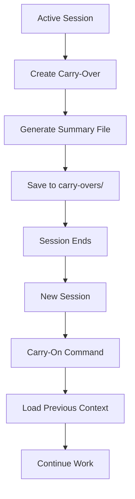
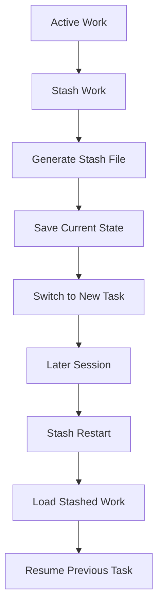
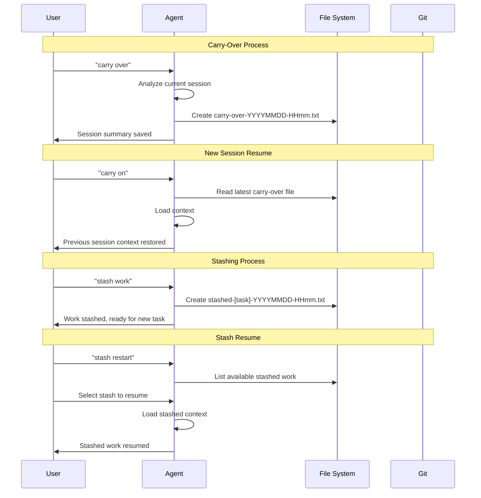

# OLAF Feature: Carry-Over and Stashing Agent Sessions

## Overview

The Carry-Over and Stashing system provides session continuity and work management capabilities for OLAF agents. This feature enables users to:

- **Carry-Over**: Create concise session summaries to continue work in future sessions
- **Stashing**: Temporarily set aside current work to resume later
- **Session Tracking**: Maintain persistent records of work progress
- **Personal Workspace**: Keep private work files excluded from version control

## Feature Purpose

This system solves the challenge of maintaining context and continuity across multiple agent sessions, allowing users to:

1. **Preserve Context**: Capture essential information from current session
2. **Resume Work**: Continue from where previous sessions left off
3. **Manage Workload**: Temporarily pause tasks without losing progress
4. **Track Progress**: Query personal work history and stashed tasks

## Bootstrap Sequence Integration

The carry-over and stashing competencies are integrated into the OLAF framework through:

### Competency Index Registration
```
carry over|carry-over|create carry over|session carry over|carry over note→project-manager/carry-over-session.md|Act
carry on|carry-on|resume from carry over|continue from carry over|carry on work→project-manager/carry-on-session.md|Act
stash work|stash current work|pause work|transition work|new work session→project-manager/stash-work-session.md|Act
stash restart|resume work|resume stashed|continue work|restart from stash→project-manager/stash-restart-session.md|Act
```

### Multi-Platform Integration
- **Windsurf IDE**: Native workflow integration
- **GitHub**: Prompt file integration for repository-based workflows
- **OLAF Core**: Direct competency execution

## Context Switch Functionality

### Carry-Over Workflow


### Stashing Workflow


### Session Continuity Flow


## File Structure and Dependencies

### Core Competency Files
```
olaf-core/prompts/project-manager/
├── carry-over-session.md      # Create session summary
├── carry-on-session.md        # Resume from carry-over
├── stash-work-session.md      # Stash current work
└── stash-restart-session.md   # Resume stashed work
```

### Platform Integration Files
```
.windsurf/workflows/           # Windsurf IDE integration
├── carry-over.md
├── carry-on.md
├── stash-work.md
└── stash-restart.md

.github/prompts/               # GitHub integration
├── carry-over.prompt.md
├── carry-on.prompt.md
├── stash-work.prompt.md
└── stash-restart.prompt.md
```

### Data Storage
```
carry-overs/                   # Personal workspace (gitignored)
├── .gitkeep                   # Ensure directory exists
├── carry-over-YYYYMMDD-HHmm.txt    # Session summaries
└── stashed-[task]-YYYYMMDD-HHmm.txt # Stashed work files
```

## Usage Examples

### Creating a Carry-Over
```
User: "carry over"
Agent: Creates carry-over-20251015-1725.txt with:
- Current session summary
- Key decisions made
- Next steps planned
- Important context to preserve
```

### Resuming from Carry-Over
```
User: "carry on"
Agent: Reads latest carry-over file and:
- Restores previous session context
- Summarizes what was accomplished
- Identifies next actions
- Continues seamlessly
```

### Stashing Current Work
```
User: "stash work"
Agent: Creates stashed-feature-development-20251015-1725.txt with:
- Current task description
- Progress made so far
- Blockers or issues
- Files being worked on
```

### Querying Work History
```
User: "what do I have done this week?"
Agent: Analyzes carry-overs/ folder and provides:
- Summary of completed sessions
- Progress on ongoing tasks
- Stashed work items
- Weekly productivity overview
```

## Privacy and Security

### Git Ignore Protection
The `carry-overs/` directory is excluded from version control via `.gitignore`:
```gitignore
# Personal work files - not for version control
carry-overs/
```

### Personal Workspace Benefits
- **Privacy**: Personal work notes stay local
- **Flexibility**: Experiment without affecting repository
- **Persistence**: Work survives across sessions and branches
- **Organization**: Structured file naming for easy retrieval

## Integration Points

### OLAF Framework Integration
- **Competency Index**: Registered patterns for natural language triggers
- **Protocol Compliance**: All competencies use "Act" protocol for immediate execution
- **Framework Validation**: Full OLAF work instructions compliance

### IDE Integration
- **Windsurf**: Native workflow files for seamless IDE integration
- **GitHub**: Prompt files for repository-based development
- **Cross-Platform**: Consistent experience across development environments

### File System Integration
- **Timestamp-based Naming**: Chronological organization of work files
- **Structured Content**: Consistent format for easy parsing
- **Automatic Discovery**: Agents can automatically find and load relevant files

## Benefits

### For Individual Users
- **Continuity**: Never lose context between sessions
- **Productivity**: Quick resume without re-explaining context
- **Organization**: Structured approach to managing multiple tasks
- **History**: Persistent record of work progress

### For Team Collaboration
- **Handoffs**: Easy transfer of work context between team members
- **Documentation**: Automatic generation of work summaries
- **Consistency**: Standardized approach to session management
- **Transparency**: Clear record of work progression

### For Project Management
- **Tracking**: Visibility into individual work patterns
- **Planning**: Better estimation based on historical data
- **Quality**: Reduced context loss and rework
- **Efficiency**: Faster session startup and context restoration

## Technical Implementation

### File Naming Convention
- **Carry-Over**: `carry-over-YYYYMMDD-HHmm.txt`
- **Stashed Work**: `stashed-[task-name]-YYYYMMDD-HHmm.txt`
- **Timestamp Format**: CEDT timezone, 24-hour format

### Content Structure
- **Header**: Metadata (timestamp, session type, duration)
- **Summary**: Concise overview of work accomplished
- **Context**: Key information needed for continuation
- **Next Steps**: Planned actions for future sessions
- **Files**: List of relevant files and their states

### Discovery Mechanism
- **Latest File**: Automatic selection of most recent carry-over
- **Pattern Matching**: Intelligent matching of stashed work to current context
- **Query Interface**: Natural language queries for work history
- **Filtering**: Date-based and task-based filtering capabilities

## Future Enhancements

### Planned Features
- **Search Integration**: Full-text search across carry-over files
- **Analytics**: Work pattern analysis and productivity insights
- **Collaboration**: Shared carry-over files for team handoffs
- **Integration**: Calendar and task management system integration

### Extensibility
- **Plugin Architecture**: Support for custom carry-over formats
- **API Integration**: Connect with external project management tools
- **Automation**: Automatic carry-over generation based on session patterns
- **Intelligence**: AI-powered work prioritization and context optimization