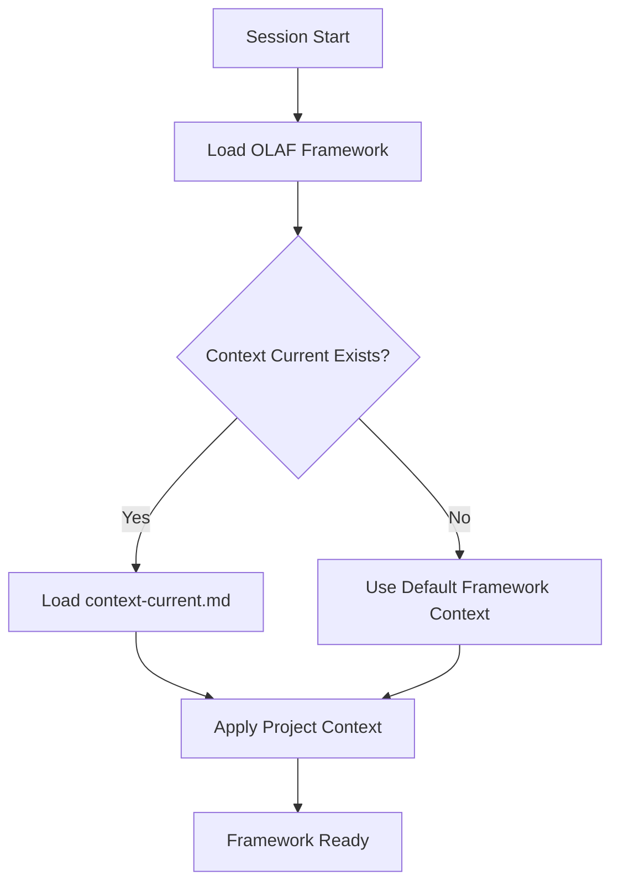
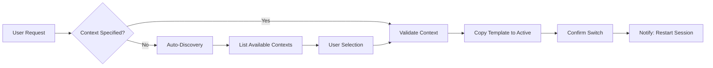
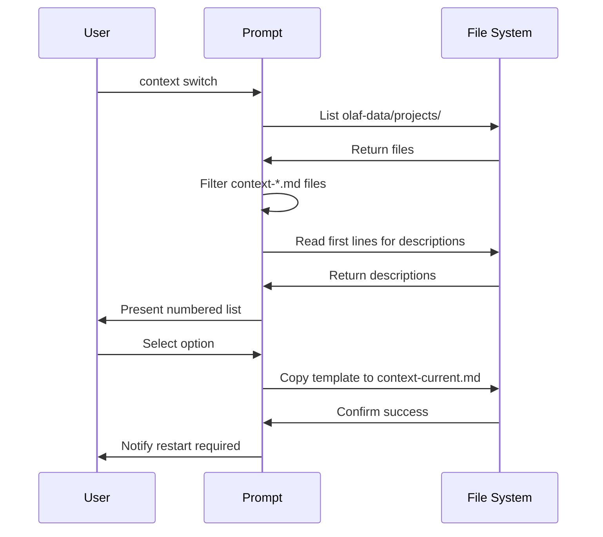

# OLAF Context Switch Feature

## Overview

The Context Switch feature enables dynamic switching between different project contexts within the OLAF framework. This feature allows users to maintain multiple project-specific configurations and seamlessly switch between them during their workflow.

## Purpose

- **Dynamic Context Management**: Switch between different project contexts without manual file editing
- **Bootstrap Integration**: Automatically loads the active context during framework initialization
- **Template-Based System**: Uses template files for consistent context structure
- **Session Isolation**: Context changes take effect in new sessions for clean state management

## Bootstrap Sequence Integration

The context switch feature is integrated into the OLAF bootstrap sequence through the following mechanism:



### Bootstrap Files Integration

The feature modifies the bootstrap sequence in three key files:

1. **`.kiro/steering/olaf-bootstrap.md`** - Kiro IDE bootstrap
2. **`.windsurf/rules/olaf-bootstrap.md`** - Windsurf IDE bootstrap  
3. **`.github/copilot-instructions.md`** - GitHub Copilot bootstrap

All bootstrap files load `context-current.md` (if it exists) after loading the core framework.

## Context Switch Workflow



## File Structure

### Template Files
- `olaf-data/projects/context-default.md` - Default project context
- `olaf-data/projects/context-springboot-hexagonal.md` - Example Spring Boot hexagonal architecture context (fictional example)
- Additional context templates can be added following the `context-{name}.md` pattern

### Active Context
- `olaf-data/projects/context-current.md` - Currently active context (copied from template)

### Core Functionality
- `olaf-core/prompts/other-users/project-switch.md` - Context switch competency prompt

## Usage Examples

### List Available Contexts
```
context switch
```
or
```
context list
```

### Switch to Specific Context
```
context switch springboot-hexagonal
```
*(Note: springboot-hexagonal is a fictional example context)*

### Clear Current Context
```
context clear
```

### Check Current Status
```
context status
```

## Context Template Structure

Each context template follows this structure:

```markdown
# Project Context - {Context Name}

## Project Overview
Brief description of the project type and context

## Architecture Overview  
Key architectural patterns and approaches

## Key Technologies
- Technology stack
- Frameworks and libraries
- Development tools

## Development Guidelines
- Coding standards
- Best practices
- Naming conventions

## Module Structure
Detailed structure and organization patterns
```

## Implementation Details

### Auto-Discovery Process



### File Operations

1. **Template Discovery**: Scans `olaf-data/projects/` for `context-*.md` files
2. **Context Activation**: Copies selected template to `context-current.md`
3. **Context Clearing**: Deletes `context-current.md` file
4. **Bootstrap Loading**: Framework loads `context-current.md` during initialization

## Dependencies

### Framework Integration
- Requires OLAF framework bootstrap sequence
- Integrates with competency routing system
- Uses standard file operation tools

### IDE Integration
- Kiro IDE steering files
- Windsurf IDE rules
- GitHub Copilot instructions

## Session Management

**Critical Requirement**: Context changes only take effect in new sessions/conversations.

### Why Session Restart is Required
- Context is loaded during framework initialization
- Changing context mid-session doesn't reload the framework
- Clean state ensures consistent behavior
- Prevents context mixing or conflicts

### User Notification
The system provides clear notifications:
```
⚠️ **IMPORTANT**: Please start a new conversation for the 'springboot-hexagonal' context to be active. 
The context change will only take effect in a fresh session.
```
*(Note: springboot-hexagonal shown as fictional example)*

## Error Handling

- **Missing Templates**: Graceful handling with clear error messages
- **Invalid Selections**: Validation of user input with helpful feedback
- **File Operation Failures**: Robust error handling with fallback options
- **Empty Directory**: Handles cases where no context templates exist

## Extensibility

### Adding New Contexts
1. Create new template file: `olaf-data/projects/context-{name}.md`
2. Follow standard context template structure
3. Include descriptive first lines for auto-discovery
4. Test context switching functionality

### Custom Context Templates
- Support for organization-specific contexts
- Technology stack specific templates
- Project type specific configurations
- Team workflow customizations

## Benefits

- **Productivity**: Quick switching between project contexts
- **Consistency**: Template-based approach ensures uniform structure
- **Flexibility**: Support for multiple project types and architectures
- **Integration**: Seamless integration with OLAF framework bootstrap
- **User Experience**: Intuitive commands and clear feedback