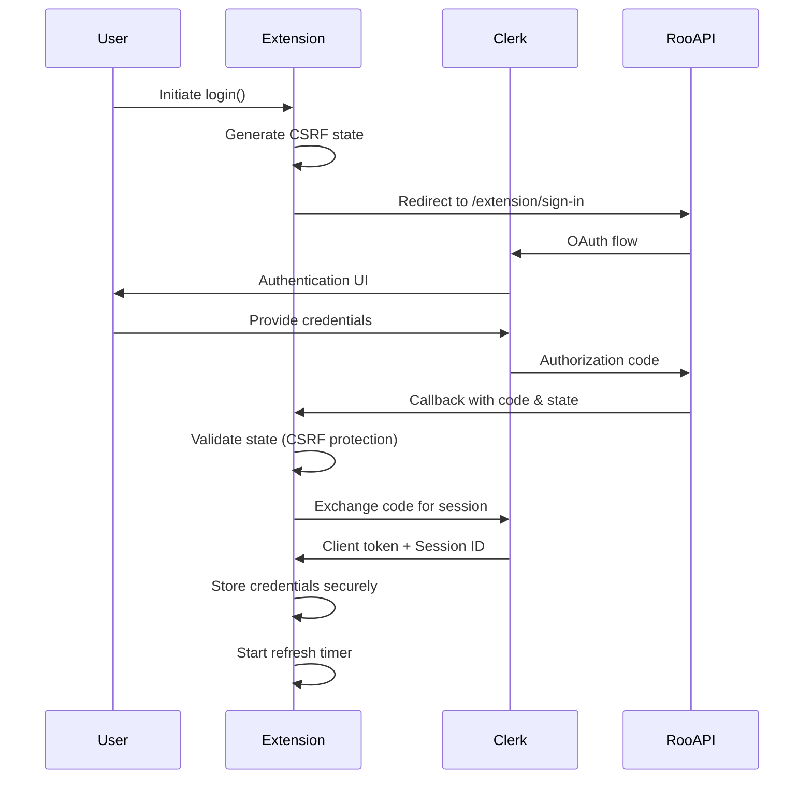
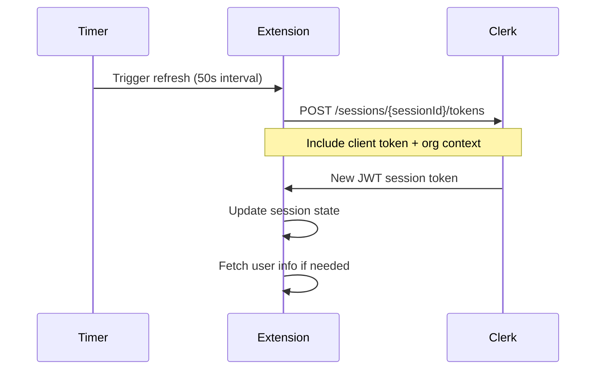

# Authentication Analysis - Roo-Code

**Analysis Date:** 20250910-1238 CEDT  
**Repository:** c:\Users\ppaccaud\coderepos\olaf-test-onboarding\Roo-Code\  
**Analyst:** OLAF Project Onboarding System  

## Executive Summary

Roo-Code implements a sophisticated dual-authentication system supporting both web-based OAuth flows and static token authentication. The system is built around Clerk authentication services with JWT token management and organization-based access control.

## Authentication Architecture

### 1. Authentication Services

#### WebAuthService
- **Location:** `packages/cloud/src/WebAuthService.ts`
- **Type:** OAuth-based web authentication
- **Provider:** Clerk authentication service
- **Features:**
  - CSRF protection with state parameters
  - Automatic session refresh (50-second intervals)
  - Organization and personal account support
  - Secure credential storage using VS Code secrets API
  - JWT token management

#### StaticTokenAuthService  
- **Location:** `packages/cloud/src/StaticTokenAuthService.ts`
- **Type:** Static JWT token authentication
- **Use Case:** Programmatic access, testing, CI/CD
- **Features:**
  - JWT token decoding and validation
  - Simplified authentication for automated systems
  - Organization context extraction from tokens

### 2. Authentication States

The system defines five distinct authentication states:

```typescript
type AuthState = "initializing" | "logged-out" | "active-session" | "attempting-session" | "inactive-session"
```

- **initializing:** System startup, loading credentials
- **logged-out:** No authentication credentials
- **active-session:** Valid session with working tokens
- **attempting-session:** Trying to establish/refresh session
- **inactive-session:** Has credentials but session failed

### 3. Token Management

#### JWT Structure
```typescript
interface JWTPayload {
  iss?: string     // Issuer ('rcc')
  sub?: string     // Subject (User ID or CloudJob ID)
  exp?: number     // Expiration time
  iat?: number     // Issued at time
  nbf?: number     // Not before time
  v?: number       // Version (1)
  r?: {
    u?: string     // User ID
    o?: string     // Organization ID
    t?: string     // Token type ('cj' for job, 'auth' for auth)
  }
}
```

#### Token Types
- **Auth Tokens:** User authentication (`t: 'auth'`)
- **Job Tokens:** Cloud job execution (`t: 'cj'`)

### 4. Security Features

#### CSRF Protection
- Cryptographically random state parameters
- State validation on callback
- Secure state storage in VS Code global state

#### Secure Storage
- Credentials stored using VS Code Secrets API
- Environment-specific credential keys
- Automatic credential migration support

#### Session Management
- Automatic token refresh with exponential backoff
- Invalid token detection and cleanup
- Session timeout handling

#### Organization Security
- Organization-based access control
- Role-based permissions
- Extension bridge feature flags per organization

## Authentication Flow Analysis

### 1. Web Authentication Flow



### 2. Token Refresh Flow



## Security Assessment

### Strengths

1. **Multi-layered Security**
   - CSRF protection with state validation
   - Secure credential storage
   - Automatic token refresh
   - Organization-based access control

2. **Robust Error Handling**
   - Invalid token detection and cleanup
   - Exponential backoff for failed requests
   - Graceful degradation on auth failures

3. **Flexible Architecture**
   - Support for both interactive and programmatic auth
   - Environment-specific configurations
   - Organization and personal account support

4. **Modern Standards**
   - JWT token format
   - OAuth 2.0 flow
   - RESTful API design

### Areas for Improvement

1. **Token Security**
   - No explicit token encryption at rest
   - Relies on VS Code Secrets API security
   - Static tokens have no expiration validation

2. **Session Management**
   - Fixed 50-second refresh interval (not configurable)
   - No session invalidation on security events
   - Limited session monitoring capabilities

3. **Error Handling**
   - Generic error messages may leak information
   - Limited audit logging for security events
   - No rate limiting on authentication attempts

## Organization Security Model

### Access Control
- Organization-based feature flags
- Role-based permissions (admin, member, etc.)
- Extension bridge enablement per organization

### Settings Management
- Organization-level default settings
- User-level setting overrides
- Provider allow/deny lists per organization

### Data Isolation
- Organization-scoped data access
- User context switching between personal/org accounts
- Secure organization metadata handling

## Recommendations

### High Priority
1. **Implement token encryption** for stored credentials
2. **Add session monitoring** and anomaly detection
3. **Implement rate limiting** for authentication endpoints
4. **Add audit logging** for security events

### Medium Priority
1. **Configurable refresh intervals** based on security requirements
2. **Token expiration validation** for static tokens
3. **Enhanced error handling** with security-conscious messaging
4. **Multi-factor authentication** support

### Low Priority
1. **Session management dashboard** for users
2. **Advanced organization security policies**
3. **Integration with external identity providers**
4. **Automated security scanning** of authentication flows

## Compliance Considerations

### Data Protection
- User credentials stored securely
- Organization data isolation
- Minimal data collection principles

### Industry Standards
- OAuth 2.0 compliance
- JWT standard implementation
- REST API security best practices

## Testing Coverage

The authentication system includes comprehensive test coverage:
- **WebAuthService:** 175 test cases covering all authentication flows
- **StaticTokenAuthService:** 57 test cases for token-based auth
- **Integration tests:** Cloud service integration scenarios

## Conclusion

Roo-Code implements a well-architected authentication system with strong security foundations. The dual-service approach (WebAuthService + StaticTokenAuthService) provides flexibility for different use cases while maintaining security standards. The organization-based access control adds enterprise-grade security features.

Key strengths include CSRF protection, secure credential storage, and robust error handling. Areas for improvement focus on enhanced token security, session monitoring, and audit capabilities.

The system demonstrates mature security practices suitable for a professional development tool with cloud integration capabilities.
