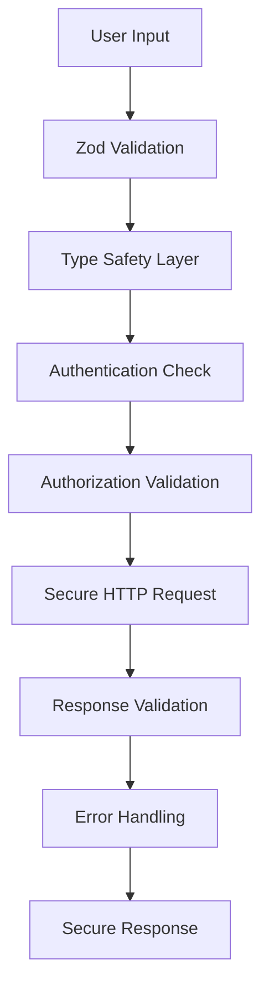

# Security Patterns Analysis - Roo-Code

**Analysis Date:** 20250910-1240 CEDT  
**Repository:** c:\Users\ppaccaud\coderepos\olaf-test-onboarding\Roo-Code\  
**Analyst:** OLAF Project Onboarding System  

## Executive Summary

Roo-Code implements comprehensive security patterns focused on input validation, secure API communication, error handling, and type safety. The codebase demonstrates mature security practices through extensive use of Zod schema validation, structured error handling, and secure HTTP communication patterns.

## Security Pattern Categories

### 1. Input Validation and Type Safety

#### Zod Schema Validation
- **Extensive Coverage:** 49+ files implementing Zod schemas
- **Pattern:** Comprehensive input validation at API boundaries
- **Key Files:**
  - `packages/types/src/cloud.ts` - 186 validation rules
  - `packages/types/src/provider-settings.ts` - 164 validation rules
  - `packages/types/src/events.ts` - 93 validation rules

#### Validation Patterns
```typescript
// Example from WebAuthService.ts
const authCredentialsSchema = z.object({
  clientToken: z.string().min(1, "Client token cannot be empty"),
  sessionId: z.string().min(1, "Session ID cannot be empty"),
  organizationId: z.string().nullable().optional(),
})

// Safe parsing pattern
const result = openRouterModelsResponseSchema.safeParse(response.data)
const data = result.success ? result.data.data : response.data.data
```

#### Type Safety Benefits
- Runtime type validation
- Compile-time type checking
- Automatic error generation for invalid inputs
- Prevention of injection attacks through strict typing

### 2. Secure HTTP Communication

#### Request Security Patterns
- **Timeout Controls:** `AbortSignal.timeout()` for all external requests
- **Bearer Token Authentication:** Consistent JWT token usage
- **User-Agent Headers:** Proper client identification
- **Content-Type Validation:** Strict JSON content type enforcement

#### CloudAPI Security Implementation
```typescript
// From CloudAPI.ts
const requestHeaders = {
  "Content-Type": "application/json",
  Authorization: `Bearer ${sessionToken}`,
  "User-Agent": getUserAgent(),
  ...headers,
}

const response = await fetch(url, {
  ...fetchOptions,
  headers: requestHeaders,
  signal: AbortSignal.timeout(timeout), // 30s default timeout
})
```

#### Network Security Features
- Request timeout protection (30-second default)
- Automatic retry mechanisms with exponential backoff
- Network error classification and handling
- Secure credential transmission

### 3. Error Handling and Security

#### Structured Error Classification
```typescript
// Custom error hierarchy
class AuthenticationError extends Error
class NetworkError extends Error  
class CloudAPIError extends Error
class TaskNotFoundError extends Error
class InvalidClientTokenError extends Error
```

#### Security-Conscious Error Handling
- **Information Disclosure Prevention:** Generic error messages for external APIs
- **Error Classification:** Specific error types for different security scenarios
- **Logging Controls:** Structured logging without sensitive data exposure
- **Graceful Degradation:** System continues operating during security failures

#### Error Response Patterns
```typescript
// From CloudAPI.ts - Secure error handling
private async handleErrorResponse(response: Response, endpoint: string): Promise<never> {
  let responseBody: unknown
  
  try {
    responseBody = await response.json()
  } catch {
    responseBody = await response.text() // Fallback for non-JSON responses
  }
  
  switch (response.status) {
    case 401:
      throw new AuthenticationError() // No sensitive details
    case 404:
      if (endpoint.includes("/share")) {
        throw new TaskNotFoundError()
      }
      throw new CloudAPIError(`Resource not found: ${endpoint}`, 404, responseBody)
    default:
      throw new CloudAPIError(
        `HTTP ${response.status}: ${response.statusText}`,
        response.status,
        responseBody,
      )
  }
}
```

### 4. Authentication Security Patterns

#### Multi-Service Architecture
- **WebAuthService:** OAuth flow with CSRF protection
- **StaticTokenAuthService:** JWT token validation
- **Unified Interface:** Common AuthService interface

#### Session Security
- **Automatic Refresh:** 50-second refresh intervals
- **Token Validation:** JWT signature and expiration checking
- **State Management:** Secure state transitions
- **Credential Storage:** VS Code Secrets API integration

#### Organization Security
- **Context Isolation:** Organization-based data separation
- **Role-Based Access:** Permission-based feature access
- **Feature Flags:** Organization-level security controls

### 5. Data Validation Patterns

#### API Response Validation
```typescript
// From openrouter.ts - External API validation
const response = await axios.get<OpenRouterModelsResponse>(`${baseURL}/models`)
const result = openRouterModelsResponseSchema.safeParse(response.data)
const data = result.success ? result.data.data : response.data.data

if (!result.success) {
  console.error("OpenRouter models response is invalid", result.error.format())
}
```

#### Configuration Validation
- **Provider Settings:** Comprehensive validation of AI provider configurations
- **Model Parameters:** Strict validation of model capabilities and limits
- **User Settings:** Type-safe configuration management

### 6. Security Configuration Patterns

#### Environment-Based Security
- **Base URL Configuration:** Environment-specific API endpoints
- **Credential Isolation:** Separate credential storage per environment
- **Feature Toggles:** Environment-based security feature control

#### Provider Security
- **API Key Management:** Secure storage and transmission of provider keys
- **Model Validation:** Verification of model capabilities and restrictions
- **Rate Limiting Awareness:** Respect for provider rate limits

## Security Architecture Analysis

### Layered Security Approach

1. **Input Layer:** Zod schema validation
2. **Transport Layer:** HTTPS with proper headers and timeouts
3. **Authentication Layer:** JWT tokens with refresh mechanisms
4. **Authorization Layer:** Organization and role-based access
5. **Error Layer:** Secure error handling and logging

### Security Boundaries



## Security Strengths

### 1. Comprehensive Input Validation
- **Coverage:** 49+ files with Zod schemas
- **Depth:** Nested object validation with custom error messages
- **Safety:** Runtime and compile-time type checking

### 2. Robust Authentication
- **Multi-Method:** OAuth and static token support
- **CSRF Protection:** State parameter validation
- **Session Management:** Automatic refresh with error handling

### 3. Secure Communication
- **Timeout Protection:** All requests have timeout controls
- **Header Security:** Proper authentication and content-type headers
- **Error Handling:** Security-conscious error responses

### 4. Type Safety
- **TypeScript:** Full type coverage across codebase
- **Runtime Validation:** Zod schema enforcement
- **API Contracts:** Strict interface definitions

## Security Gaps and Recommendations

### High Priority

1. **Content Security Policy (CSP)**
   - **Gap:** No CSP headers for web components
   - **Risk:** XSS vulnerability in webview components
   - **Recommendation:** Implement strict CSP for all web interfaces

2. **Rate Limiting**
   - **Gap:** No client-side rate limiting implementation
   - **Risk:** API abuse and DoS potential
   - **Recommendation:** Implement exponential backoff and rate limiting

3. **Input Sanitization**
   - **Gap:** Limited HTML/script sanitization
   - **Risk:** XSS in user-generated content
   - **Recommendation:** Add DOMPurify or similar sanitization

### Medium Priority

4. **Audit Logging**
   - **Gap:** Limited security event logging
   - **Risk:** Insufficient incident response capabilities
   - **Recommendation:** Implement comprehensive audit logging

5. **Secret Management**
   - **Gap:** Reliance on VS Code Secrets API only
   - **Risk:** Limited enterprise secret management options
   - **Recommendation:** Support external secret management systems

6. **Certificate Pinning**
   - **Gap:** No certificate pinning for critical APIs
   - **Risk:** Man-in-the-middle attacks
   - **Recommendation:** Implement certificate pinning for Clerk and Roo APIs

### Low Priority

7. **Security Headers**
   - **Gap:** Limited security header implementation
   - **Risk:** Various web-based attacks
   - **Recommendation:** Add HSTS, X-Frame-Options, etc.

8. **Dependency Scanning**
   - **Gap:** No automated security scanning
   - **Risk:** Vulnerable dependencies
   - **Recommendation:** Implement automated dependency scanning

## Security Testing Coverage

### Current Testing
- **Authentication Flows:** Comprehensive test coverage (175+ tests)
- **API Validation:** Schema validation testing
- **Error Handling:** Error scenario testing

### Testing Gaps
- **Security Penetration Testing:** No evidence of security testing
- **Fuzzing:** No input fuzzing tests
- **Load Testing:** No security-focused load testing

## Compliance and Standards

### Current Compliance
- **OAuth 2.0:** Proper implementation
- **JWT Standards:** RFC 7519 compliance
- **HTTP Security:** Basic security headers

### Standards Gaps
- **OWASP Guidelines:** Partial compliance
- **Security Frameworks:** No formal security framework adoption
- **Privacy Standards:** Limited privacy control implementation

## Conclusion

Roo-Code demonstrates strong security foundations with comprehensive input validation, robust authentication mechanisms, and secure communication patterns. The extensive use of Zod for type safety and validation provides excellent protection against common input-based attacks.

Key strengths include the multi-layered security approach, comprehensive error handling, and mature authentication system. The codebase shows security-conscious development practices with proper separation of concerns and secure defaults.

Primary improvement areas focus on web security (CSP, sanitization), operational security (audit logging, monitoring), and enterprise security features (advanced secret management, certificate pinning).

The security architecture is well-suited for a professional development tool with appropriate protections for user data and system integrity.
