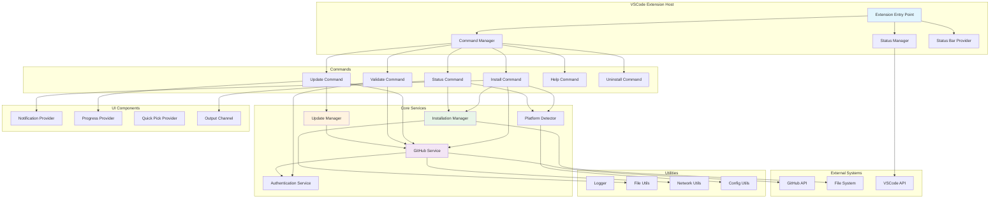
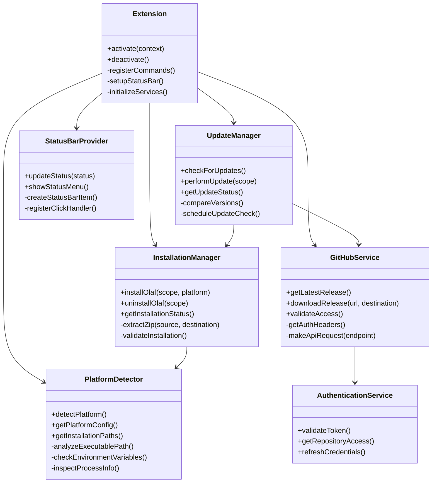
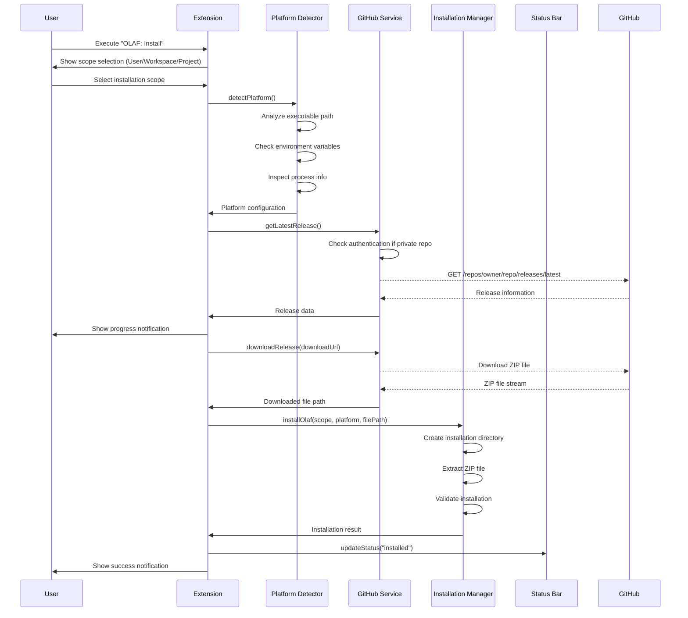
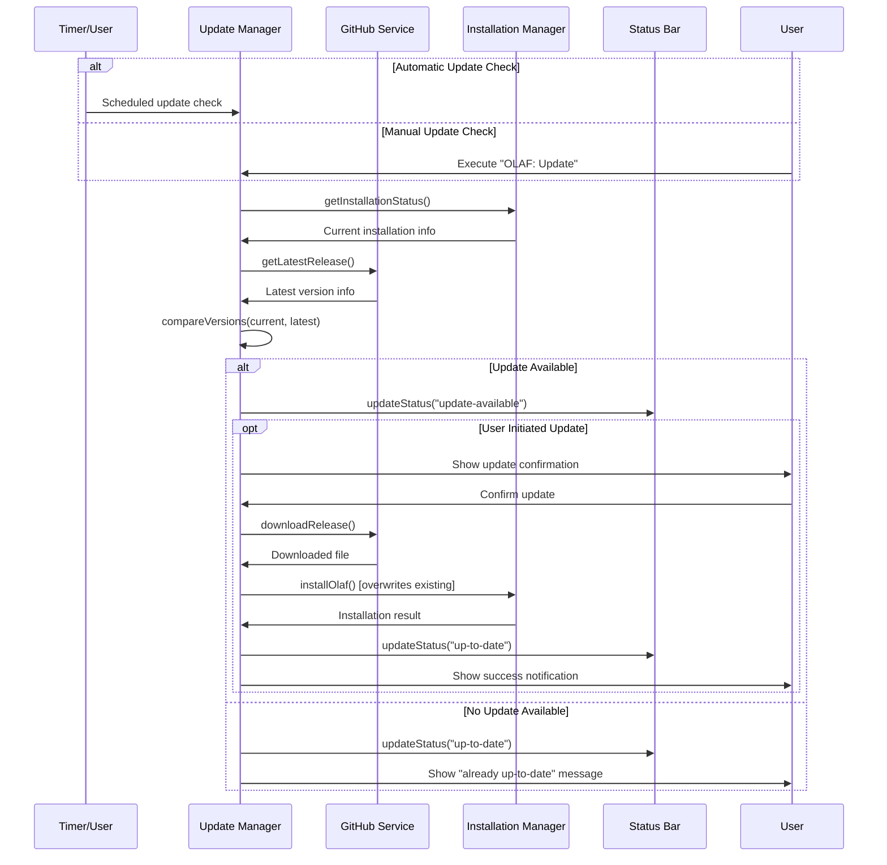
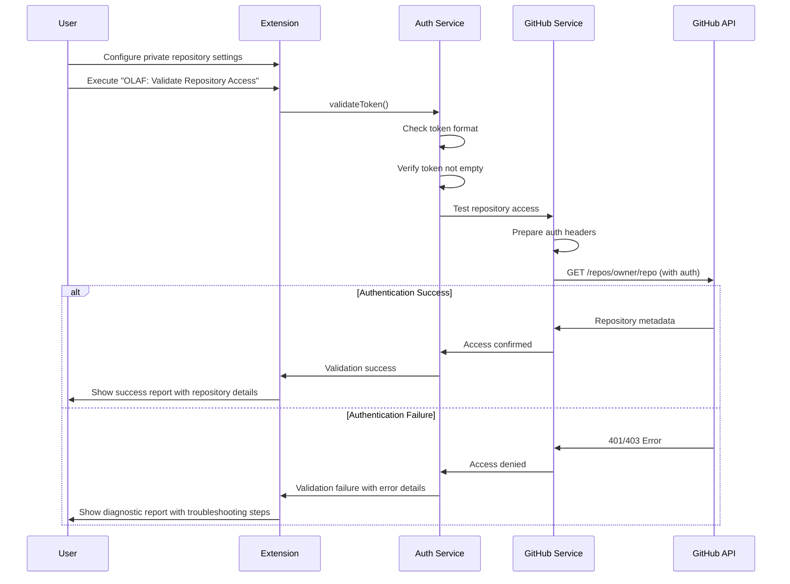
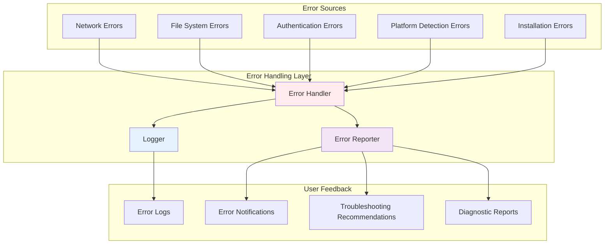
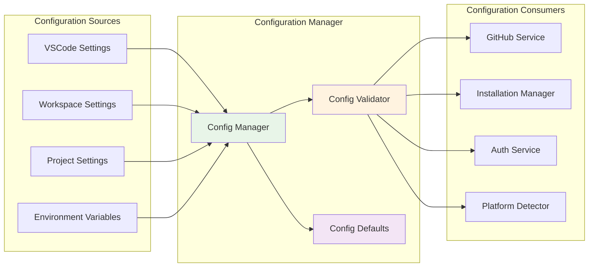
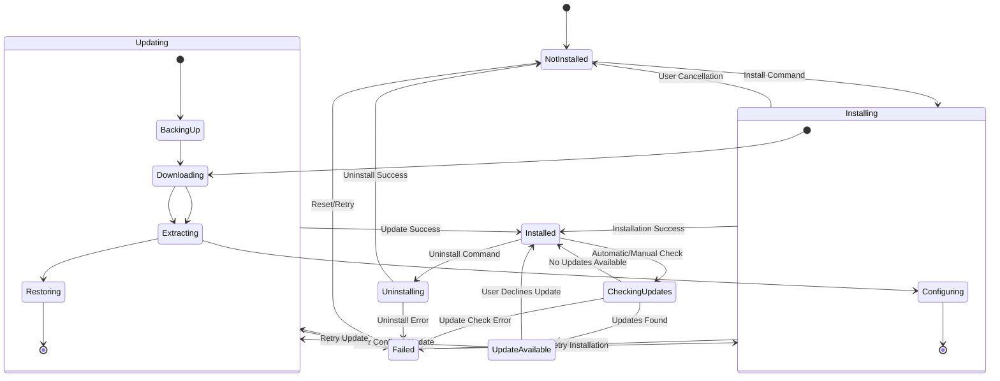
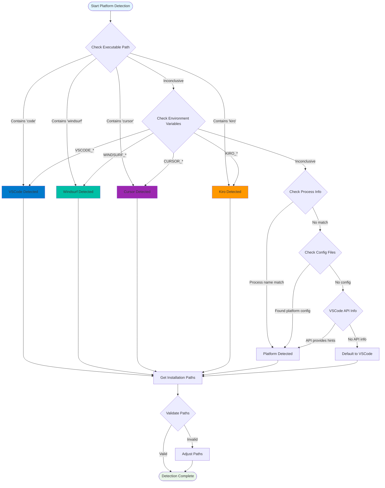

# OLAF VSCode Extension

A comprehensive Visual Studio Code extension for managing OLAF (Open Lightweight Assistant Framework) installations across multiple IDE platforms including VSCode Copilot and Windsurf.

## Features

- **Multi-Platform Support**: Automatically detects your IDE platform (VSCode Copilot, Windsurf) and provides platform-specific functionality
- **Smart Installation Management**: Install OLAF components with multiple scope options (user, workspace, project)
- **Automatic Updates**: Check for and install updates automatically with progress tracking
- **GitHub Integration**: Direct integration with GitHub releases for seamless downloads
- **Status Monitoring**: Real-time status display in the status bar with quick access to commands
- **Comprehensive Logging**: Detailed logging with multiple levels for debugging and monitoring

## Installation

### From VSCode Marketplace
1. Open VSCode
2. Press `Ctrl+Shift+X` (Windows/Linux) or `Cmd+Shift+X` (macOS) to open Extensions view
3. Search for "OLAF"
4. Click "Install"

### From VSIX Package
1. Download the latest `.vsix` file from [GitHub Releases](https://github.com/AmadeusITGroup/olaf/releases)
2. Open VSCode
3. Press `Ctrl+Shift+P` (Windows/Linux) or `Cmd+Shift+P` (macOS)
4. Type "Extensions: Install from VSIX"
5. Select the downloaded `.vsix` file

## Commands

The extension provides the following commands accessible via the Command Palette (`Ctrl+Shift+P` / `Cmd+Shift+P`):

### Primary Commands
- **`OLAF: Install`** - Install OLAF components with scope selection
- **`OLAF: Update`** - Update OLAF components or check for updates
- **`OLAF: Status`** - Show current installation status and version information
- **`OLAF: Validate Repository Access`** - Test GitHub repository access and authentication

### Command Usage

#### Installing OLAF
1. Open Command Palette (`Ctrl+Shift+P` / `Cmd+Shift+P`)
2. Type "OLAF: Install" and press Enter
3. Select installation scope:
   - **User**: Install for the current user
   - **Workspace**: Install for the current workspace
   - **Project**: Install for the current project
4. Follow the progress indicators

#### Updating OLAF
1. Open Command Palette (`Ctrl+Shift+P` / `Cmd+Shift+P`)
2. Type "OLAF: Update" and press Enter
3. Choose update options:
   - **Check for Updates**: Check all scopes for available updates
   - **Update All**: Update all installed components
   - **Update User**: Update user-scope installation
   - **Update Workspace**: Update workspace-scope installation  
   - **Update Project**: Update project-scope installation

#### Checking Status
1. Open Command Palette (`Ctrl+Shift+P` / `Cmd+Shift+P`)
2. Type "OLAF: Status" and press Enter
3. View detailed status information including:
   - Detected platform
   - Installation status per scope
   - Version information
   - Update availability

#### Validating Repository Access
1. Open Command Palette (`Ctrl+Shift+P` / `Cmd+Shift+P`)
2. Type "OLAF: Validate Repository Access" and press Enter
3. Review the detailed validation report showing:
   - Repository configuration
   - Authentication status
   - Connectivity test results
   - Recommendations for fixing issues

## Status Bar Integration

The extension adds an OLAF status indicator to the VSCode status bar:

- **🟢 OLAF**: Everything is up-to-date
- **🟡 OLAF**: Updates available
- **🔴 OLAF**: Installation issues or errors
- **⚪ OLAF**: Not installed or status unknown

Click the status bar item to quickly access OLAF commands.

## Platform Support

### Supported Platforms
- **Visual Studio Code** - Full support
- **Windsurf** - Full support with platform-specific optimizations
- **Cursor** - Full support with AI-assisted development features
- **Kiro** - Full support with collaborative development features

### Platform Detection
The extension automatically detects your IDE platform using multiple methods:
- Executable path analysis
- Environment variable detection
- Process information analysis
- Configuration file inspection
- VSCode API information

## Configuration

The extension can be configured through VSCode settings:

```json
{
  "olaf.autoCheckUpdates": true,
  "olaf.installationScope": "user",
  "olaf.enableLogging": true,
  "olaf.githubApiUrl": "https://api.github.com",
  "olaf.repositoryOwner": "AmadeusITGroup",
  "olaf.repositoryName": "olaf",
  "olaf.githubToken": "",
  "olaf.usePrivateRepository": false
}
```

### Configuration Options

- **`olaf.autoCheckUpdates`** (boolean): Enable automatic update checking (default: `true`)
- **`olaf.installationScope`** (string): Default installation scope - `user`, `workspace`, `project` (default: `user`)
- **`olaf.enableLogging`** (boolean): Enable detailed logging for debugging purposes (default: `true`)
- **`olaf.githubApiUrl`** (string): GitHub API URL for fetching releases (default: `https://api.github.com`)
- **`olaf.repositoryOwner`** (string): GitHub repository owner/organization name (default: `AmadeusITGroup`)
- **`olaf.repositoryName`** (string): GitHub repository name (default: `olaf`)
- **`olaf.githubToken`** (string): GitHub personal access token for private repositories (generate with `gh auth token`)
- **`olaf.usePrivateRepository`** (boolean): Enable access to private GitHub repositories using authentication (default: `false`)

## Private Repository Authentication

The extension supports accessing OLAF bundles from private GitHub repositories with proper authentication.

### Setting Up Authentication

1. **Authenticate with GitHub CLI** (if not already done):
   ```bash
   gh auth login
   ```

2. **Generate an authentication token**:
   ```bash
   gh auth token
   ```

3. **Configure the extension**:
   - Open VSCode Settings (`Ctrl+,` / `Cmd+,`)
   - Search for "OLAF"
   - Set the following options:
     - **Repository Owner**: Your organization name (e.g., `your-org`)
     - **Repository Name**: Your OLAF repository name (e.g., `olaf-private`)
     - **GitHub Token**: Paste the token from step 2
     - **Use Private Repository**: Enable this option

4. **Validate access**:
   - Open Command Palette (`Ctrl+Shift+P` / `Cmd+Shift+P`)
   - Run "OLAF: Validate Repository Access"
   - Review the validation results

### Authentication Requirements

- **Token Permissions**: The GitHub token needs `repo` scope for private repositories
- **Repository Access**: Your GitHub account must have read access to the target repository
- **Organization Access**: For organization repositories, ensure you have the necessary permissions

### Troubleshooting Authentication

If authentication fails:

1. **Check token validity**:
   ```bash
   gh auth status
   ```

2. **Verify repository access**:
   ```bash
   gh repo view your-org/your-repo
   ```

3. **Re-generate token if needed**:
   ```bash
   gh auth refresh -s repo
   gh auth token
   ```

4. **Use the validation command**:
   - Run "OLAF: Validate Repository Access" to get detailed diagnostic information

## Development

### Prerequisites
- Node.js 18.x or higher
- npm 8.x or higher
- VSCode 1.74.0 or higher

### Building from Source
```bash
# Clone the repository
git clone https://github.com/AmadeusITGroup/olaf.git
cd olaf/vscode-extension

# Install dependencies
npm install

# Build the extension
npm run compile

# Package the extension
npm run package

# Install locally for testing
code --install-extension olaf-*.vsix
```

### Development Scripts
- **`npm run compile`** - Compile TypeScript source
- **`npm run watch`** - Watch for changes and recompile
- **`npm run test`** - Run unit tests
- **`npm run lint`** - Run ESLint
- **`npm run package`** - Create VSIX package
- **`npm run publish`** - Publish to marketplace

### Testing
```bash
# Run all tests
npm run test

# Run specific test suite
npm run test -- --grep "PlatformDetector"

# Run tests with coverage
npm run test:coverage
```

## Architecture

### Core Components

#### Services
- **`PlatformDetector`** - Multi-method platform detection and configuration
- **`GitHubService`** - GitHub API integration for releases and downloads
- **`InstallationManager`** - ZIP extraction and file management for installations
- **`UpdateManager`** - Version checking and update orchestration

#### Commands
- **`InstallCommand`** - Handles installation workflow with user interaction
- **`UpdateCommand`** - Manages update checking and installation
- **`StatusCommand`** - Provides status information and diagnostics

#### UI Components
- **`StatusBar`** - Status bar integration with click handlers
- **`Notifications`** - User notifications and progress reporting

#### Utilities
- **`Logger`** - Centralized logging with multiple levels
- **`FileUtils`** - File system operations and path management
- **`NetworkUtils`** - HTTP operations and connectivity checking

### Data Flow
1. **Platform Detection** - Identify current IDE platform and configuration
2. **GitHub Integration** - Fetch release information and download bundles
3. **Installation Management** - Extract and install components to correct locations
4. **Status Tracking** - Monitor installation state and update availability
5. **User Interface** - Provide feedback through status bar and notifications

## Extension Architecture

This section provides a comprehensive overview of the OLAF VSCode Extension architecture, including component relationships, data flows, and interaction patterns.

### High-Level Architecture



### Component Architecture



### Installation Flow



### Update Flow



### Authentication Flow



### Error Handling Architecture



### Configuration Management



### Status Management System



### Platform Detection Strategy



## Troubleshooting

### Common Issues

#### Installation Fails
- **Check internet connectivity**: Ensure you can access GitHub
- **Verify permissions**: Make sure VSCode has write access to installation directories
- **Check disk space**: Ensure sufficient space for installation
- **Review logs**: Open Output panel and select "OLAF" channel

#### Platform Not Detected
- **Restart IDE**: Close and reopen your IDE
- **Check installation**: Verify you're using a supported platform
- **Manual detection**: Use "OLAF: Status" command to see detection details

#### Updates Not Working
- **Check update settings**: Verify `olaf.autoUpdate` is enabled
- **Manual update**: Use "OLAF: Update" command
- **Clear cache**: Restart VSCode to reset update checking

### Log Analysis
Access detailed logs through:
1. Open Output panel (`View > Output`)
2. Select "OLAF" from the dropdown
3. Review log messages for error details

### Getting Help
- **GitHub Issues**: [Report bugs or request features](https://github.com/AmadeusITGroup/olaf/issues)
- **Documentation**: [Read the full documentation](https://github.com/AmadeusITGroup/olaf/wiki)
- **Community**: [Join our discussions](https://github.com/AmadeusITGroup/olaf/discussions)

## Contributing

We welcome contributions! Please see our [Contributing Guide](CONTRIBUTING.md) for details.

### Development Workflow
1. Fork the repository
2. Create a feature branch
3. Make your changes
4. Add tests for new functionality
5. Ensure all tests pass
6. Submit a pull request

## License

This project is licensed under the MIT License - see the [LICENSE](LICENSE) file for details.

## Changelog

See [CHANGELOG.md](CHANGELOG.md) for a detailed history of changes.

---

**Note**: This extension is designed to work across multiple VSCode-compatible IDEs. If you encounter platform-specific issues, please report them with your platform details.
